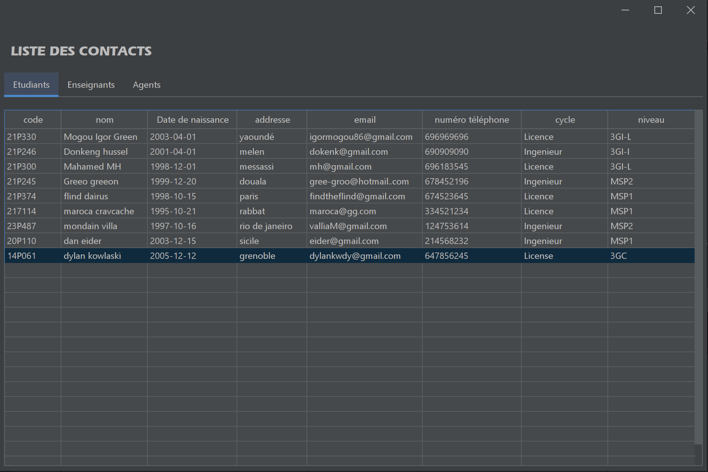
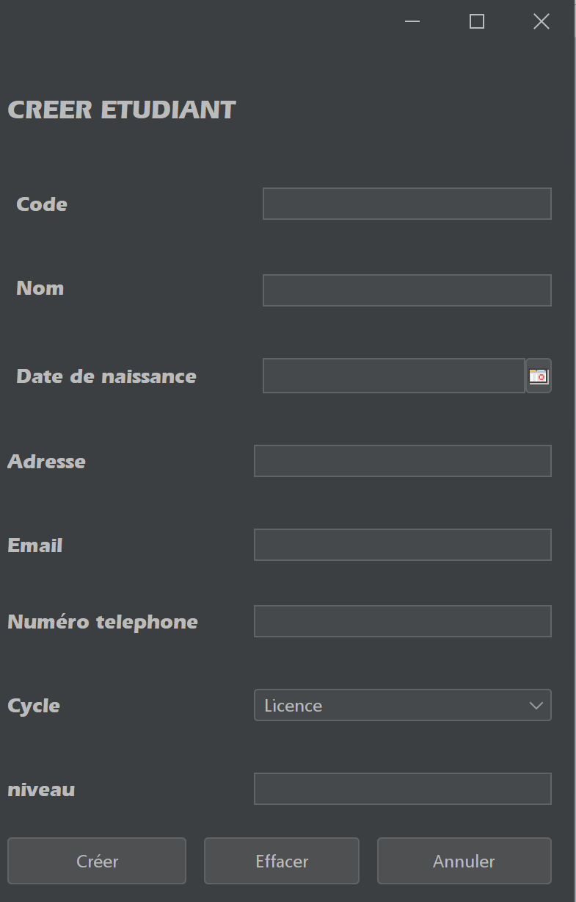
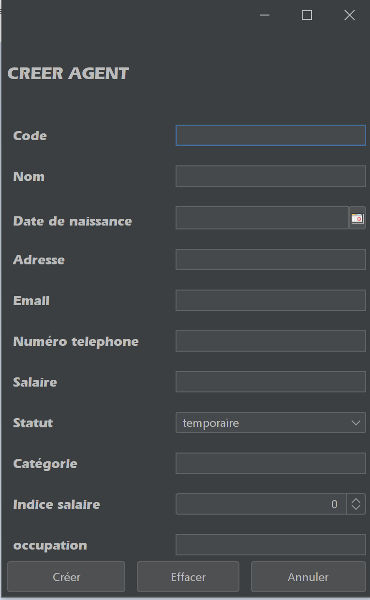
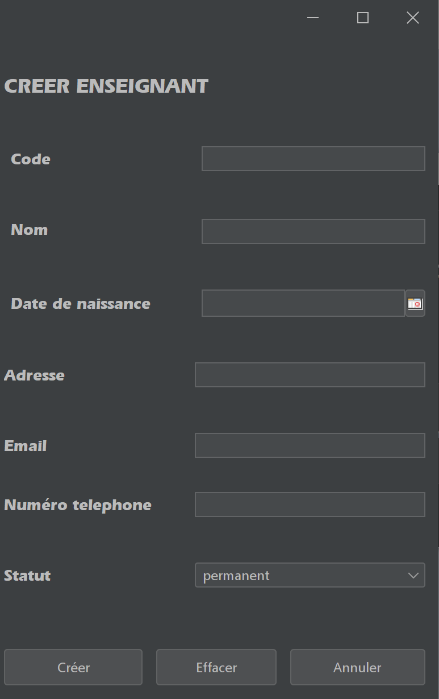
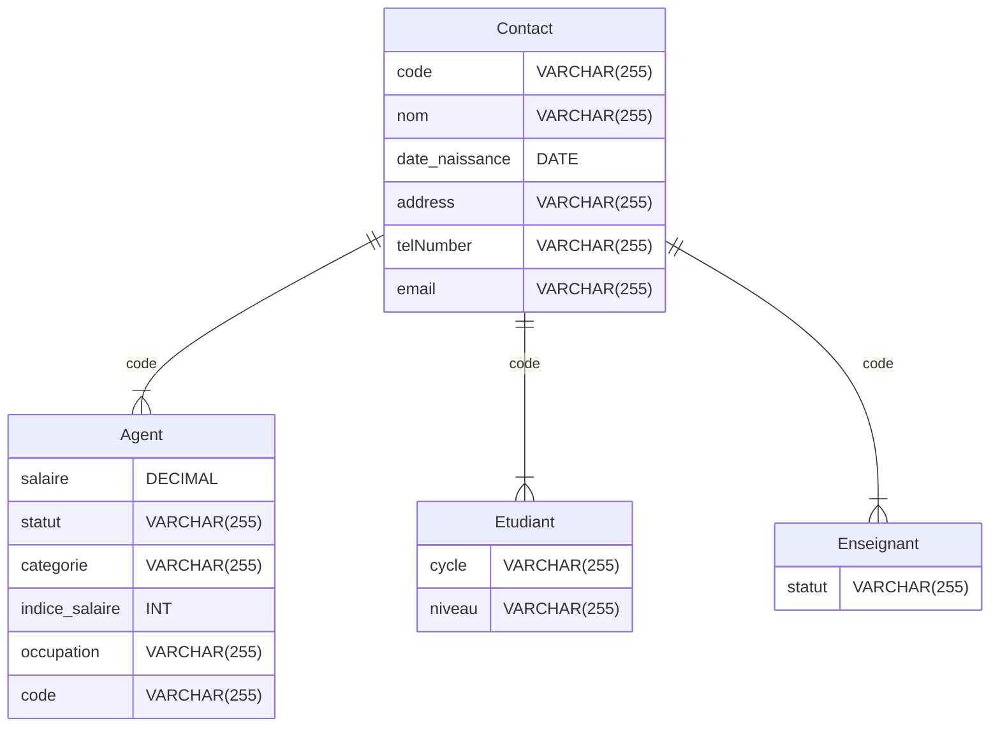

# Mini-Projet POO 
Réalisé par Mogou Igor Green, 3GI
Ce mini-projet est une application de gestion de répertoire de contacts, développée en Java dans le cadre d'un cours de Programmation Orientée Objet (POO).

## Interface graphique
### affichage de la liste des contacts

### interface de création de contacts
<div style="display:flex;">
  
  
  
</div>

## Schéma de la base de données :



## Utilisation

Pour utiliser cette application, vous pouvez suivre les étapes suivantes :

1. Clonez ce dépôt sur votre machine locale
```shell
git clone https://github.com/IgorGreenIGM/mini-projet-poo/edit/master
```
2. Ouvrez le projet dans Apache netbeans
3. Lancez le fichier `ui/MainFrmApplication.java`

## Auteur

Ce projet a été développé par Mogou Igor Green -- 3GI -- 21P246

## Licence

Ce projet est sous licence MIT. Voir le fichier LICENSE pour plus de détails.
